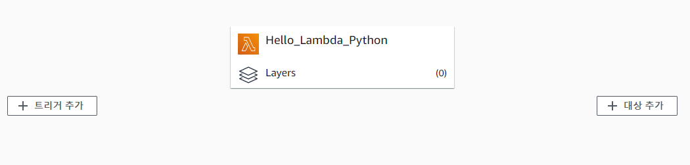

#### AWS Lambda

- Serverless 플랫폼으로써 별도의 서버를 구축하지 않아도 서버의 기능을 온전히 이용하는 서비스
- 구성도 : **플레이어(클라이언트) -> API 게이트웨이 -> AWS Lambda <---> DB**
- 즉,  클라이언트가 요청(request)을 하면 API 게이트웨이( 별도의 웹 서버처럼 동작 )가 요청을 받아서 Lambda로 넘겨주고 Lambda에서 작성한 **함수**역할로 작동한다. (DB 연동 , 단순 출력...등등)
  - API Gateway? -> 클라이언트와 백엔드 서비스 컬렉션 사이에 위치하는 API 관리 툴
- 이를 실제로 서버처럼 동작하도록 하기 위해선 API 게이트웨이를 이용해 공인 주소를 설정해야 한다.
- 

- 어떤 특정한 이벤트(로그 발생, 클라이언트 접속 등)가 발생했을 때, 람다가 처리하게 되고 처리 후에는 어떻게 행동할지 정해주면 된다(대상 추가)

- 기본적인 라이브러리와 AWS 라이브러리만 제공된다.
- 즉, 범용적이고 실용적인 프로그램(머신러닝, 크롤링 등)을 실행시키기 위해선 라이브러리를 통째로 압축해서 업로드하는 기능이 있다. 